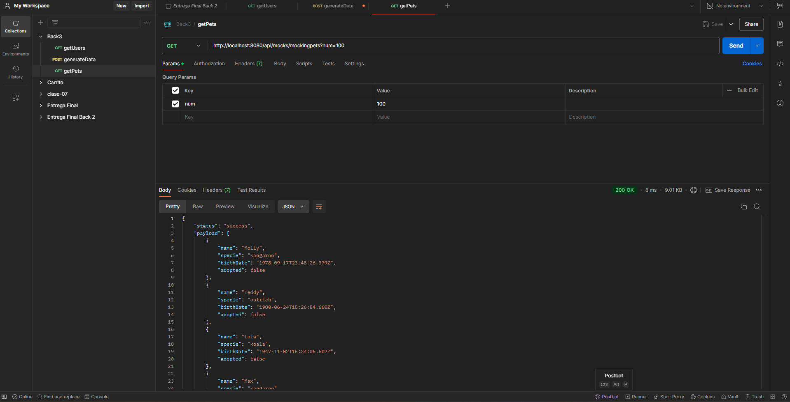
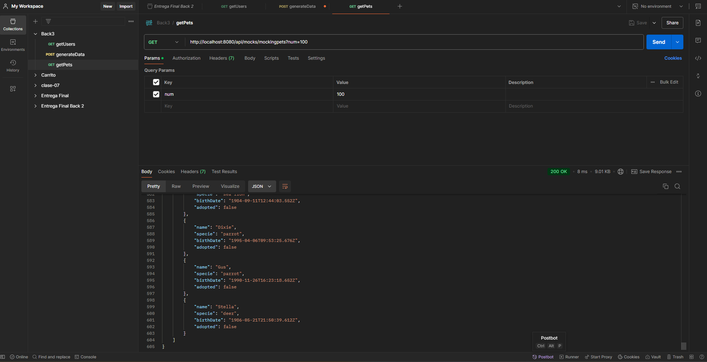
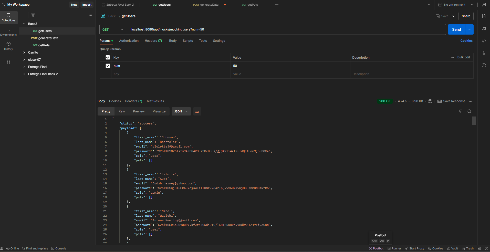
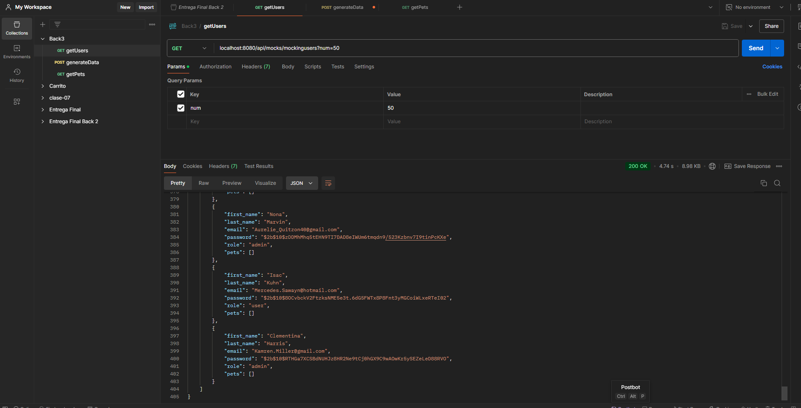
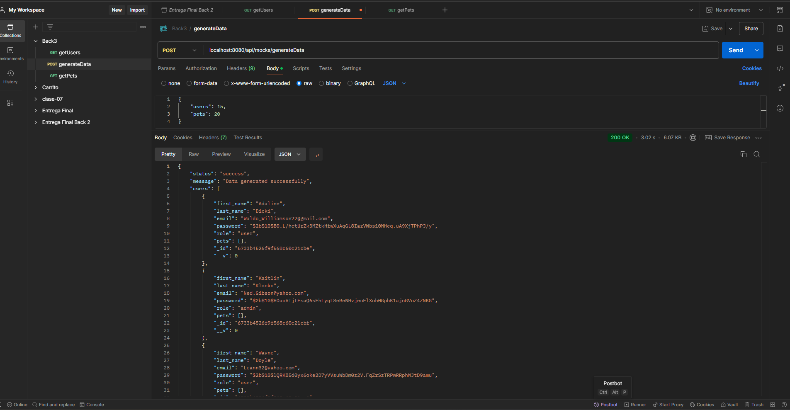
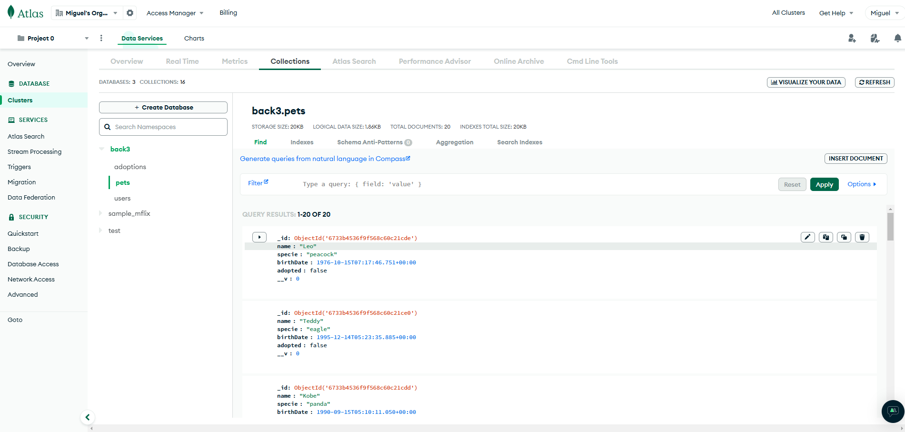
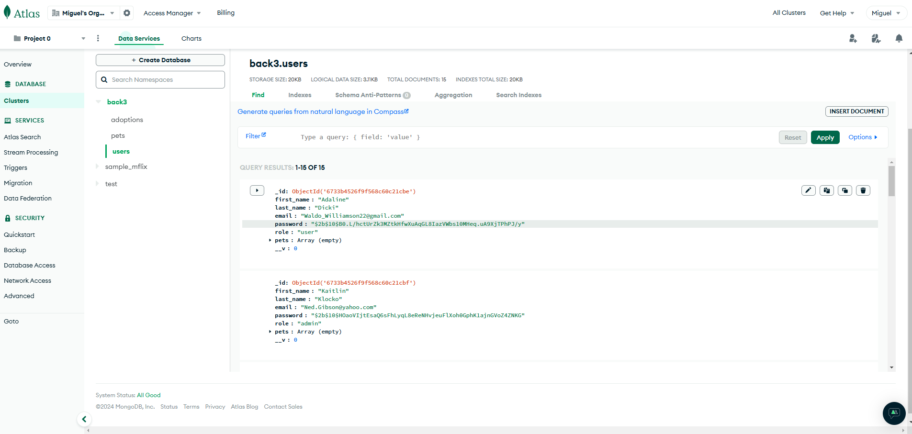

# Proyeto de Backend, Tercera Parte, del curso de CoderHouse: Programación Backend III: Testing y Escalabilidad Backend

Entrega final de la tercera parte del proyecto del Curso de Programacion Backend de CoderHouse. Se trata de un pequeño proyecto sobre usuarios y mascotas, proporcionado por Coderhouse, para pdoer realizar distintas actividades teniendtes al aprendizaje de Node, Express, Docker y demás herramientas del curso mencionado.-

## Tabla de Contenidos

- [Características](#características)
- [Tecnologías Utilizadas](#tecnologías-utilizadas)
- [Instalación](#instalación)
- [Uso](#uso)
- [Docker](#docker)

## Características

- Creacion de Usuarios
- Creacion de Mascotas
- Guardado de datos en la Base de Datos de MongoDB
- Documentacion mediante Swagger: se ha documentado el router de usuarios y el de pets mediante swagger. Para ello, se debe inngresar a la ruta http://localhost:YOUR_PORT/api-docs/users o http://localhost:YOUR_PORT/api-docs/pets

## Tecnologías Utilizadas

- **Backend:** 
  - Node.js
  - Express
  - MongoDB (Mongoose)
  - Passport.js (JWT)
  - @faker-js/faker

  - Docker

## Instalación

1. Clona el repositorio:

   ```bash
   git clone https://github.com/maiguelm/back-coderhouse.git
   cd back-coderhouse

2. Instala las dependencias:
npm install

3. Configura el archivo .env:

Crea un archivo .env en la raíz del proyecto y agrega las siguientes variables de entorno:
MONGO_URL
PERSISTENCE

## Uso
Inicia el servidor con los comandos "npm start" o "npm run dev"


Se deben realizar las siguientes consultas via Postman:
GET: http://localhost:"your-port"/api/mocks/mockingpets?num=100 -- A los fines de obtener mascotas. Si no se indica un numero, por defecto se obtendrán 100.-




GET: http://localhost:"your-port"/api/mocks/mockingusers?num=50 -- A los fines de obtener usuarios. Si no se indica un numero, por defecto se obtendrán 50.-



POST: http://localhost:"your-port"/api/mocks/generateData -- Se generara la data para guardarla en la base de datos.-
El cuerpo de esta ultima peticion es el siguiente (los numeros son a modo de ejemplo):
{
	"users": 15,
	"pets": 20
}

El formato de la misma debe ser JSON




Resultados en la base de datos de MONGODB



## Docker
Hay una imagen del proyecto en Docker Hub, a la que se puede acceder mediante este enlace:
https://hub.docker.com/repository/docker/migmoyano/entrega-final/general
